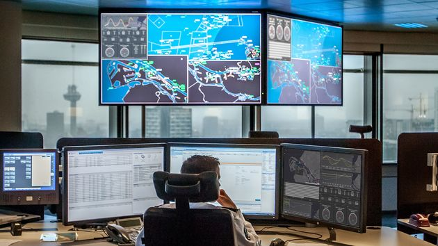

# 第一章：物联网技术概述

在第一章中，我们将对物联网（IoT）技术进行全面探讨，从基本概念、发展历程、基础架构，到其在各种应用场景中的实际应用，特别是在航海领域的应用。我们首先将介绍物联网的基本概念，它是指通过互联网将各种信息传感设备与网络连接起来，实现物物相连、人物互动的一种网络技术。接着，我们将追溯物联网的发展历程，展示它从一个概念到成为当今社会不可或缺的技术的演变过程。在讨论物联网的基础架构时，我们将详细解析其组成部分，包括感知层、网络层和应用层等，这些层次共同构成了物联网的整体框架。此外，我们还将探讨物联网的常见应用场景，例如智能家居、智慧农业、智慧交通、工业物联网等，这些应用展示了物联网技术在改善人类生活和提升工业效率方面的巨大潜力。特别地，我们还将专门讨论物联网在航海中的应用，这是物联网技术在特定领域应用的一个典型例子。在航海领域，物联网通过优化船舶运营、增强航行安全、提高燃油效率等方面，为海上交通带来了革命性的变化。这些应用不仅提升了海上运输的效率和安全性，还将为绿色低碳航运提供重要的技术支持。

## 1.1 物联网发展历程

> 小故事：“特洛伊咖啡壶”
> 
>1991年的“特洛伊咖啡壶”事件应该是物联网思想萌芽的一个重要里程碑。这个事件源自剑桥大学科学家们的日常烦恼，他们工作时经常需要下两层楼梯到楼下查看咖啡壶，但往往因为没有计算好时间而空手而归。为解决这个问题，他们编写了一套程序，并在咖啡壶旁安装了便携式摄像机，利用计算机图像捕捉技术，以3帧/秒的速率将图像传输到楼上实验室的计算机上，方便实时查看咖啡是否煮好，避免了频繁上下楼的麻烦。
>
>这个简单的“咖啡观测”系统经过更新，在1993年连接到了互联网，成为了全球首个网络数字摄像机应用案例。该系统以1帧/秒的速率通过实验室的网站进行直播，吸引了全世界近240万网民的关注。这一不经意的创意引起了全球轰动，甚至使得数以万计的电子邮件涌入剑桥大学，询问这个神奇的咖啡壶。最终，这只闻名于网络的咖啡壶在2001年8月以7300美元的价格在eBay拍卖网站被卖出，成为数字世界的一个传奇。这个事件不仅预示了物联网在远程监控和日常生活自动化中的巨大潜力，也展示了物联网技术如何从一个简单的日常需求发展成为全球性的技术趋势。

1.1.1 萌芽中的物联网理念

跟上面类似的例子发生在更早的1982年，[卡内基梅隆大学](https://www.engineersrule.com/how-a-coke-machine-and-the-industrial-internet-of-things-can-give-birth-to-a-planetary-computer/)计算机科学系的程序员们经常会很沮丧，因为他们需要长途步行到可乐机，却发现里面是空的，或者更糟糕的是，里面只是装满了温热的苏打水。因此，他们决定将可乐机连接到互联网。他们在可乐机内安装了许多微动开关，使其能够通过互联网提供内部饮料的存量和温度信息。任何能够访问该可乐机IP地址的人都可以查看这些信息。另一个故事发生在1989年的Interop互联网网络展上，展会主席Dan Lynch向[John Romkey](https://www.livinginternet.com/i/ia_myths_toast.htm)提出了一个挑战：如果他能在明年的展会上展示一个连接到互联网的烤面包机，就能获得主要展示位置。Romkey接受了挑战，并与他的朋友Simon Hackett合作，成功将一台Sunbeam Deluxe Automatic Radiant Control烤面包机连接到互联网。这台烤面包机通过TCP/IP网络连接，并使用简单网络管理协议管理信息库（SNMP MIB）进行控制。它只有一个控制按钮，用于开启电源，而烤面包的程度则取决于电源开启的时长。1991年，他们又添加了一个小型机械臂，也由互联网控制，实现了从插入面包片到烤制的全自动化。

关键技术进步如1995年GPS卫星计划的完成和1998年向IPv6的过渡，这使得更多的设备能够连接到互联网，这对于物联网概念的形成和物联网基础设施的建设都是至关重要的。1995年，美国军方宣布GPS星座中的所有24颗卫星已达到完全操作能力（FOC）。1998年，美国副总统Al Gore宣布了[GPS III](https://www.geotab.com/blog/gps-satellites/#:~:text=,for%20civilian%20and%20aircraft%20use)卫星计划，该计划旨在为民用和航空用途发送两个额外的信号。这标志着GPS技术成熟，为物联网设备提供了关键的定位能力，从而开启了位置感知设备和服务的新时代。物联网发展历程中另一个值得注意的事件是互联网[IPv6](https://www.networkworld.com/article/3254575/what-is-ipv6-and-why-aren-t-we-there-yet.html)的发展。 互联网协议第六版（IPv6）的开发始于1994年，并在1998年形成了最终版本。IPv6将地址字段扩展到128位，从而解决了IPv4地址空间的不足。IPv4使用32位地址方案，支持约43亿个设备。相比之下，IPv6可以支持大约340万亿万亿（即2的128次方）个设备。这为连接到互联网的设备数量的大幅增长提供了可能，是IoT设备普及的重要基础。​

比尔·盖茨在其著作[《未来之路》](https://en.wikipedia.org/wiki/The_Road_Ahead_%28Gates_book%29)（The Road Ahead）中，深入探讨了个人计算革命的影响，并描述了一个由全球信息高速公路深刻改变的未来世界。这本书首次发表于1995年，盖茨在书中提出了他对未来技术发展趋势的视野，他强调了计算机仅仅作为一个工具的观点，并且提出了将来可能面临的十二个重点问题，并讨论了应对这些问题的必要性​​。这本书以通俗易懂的方式展示了未来的工具和新兴技术，特别是“信息高速公路”，将如何改变我们生活和工作的方式​​。《未来之路》不仅仅是对技术未来的预测，更是对数字化世界如何塑造我们工作和生活方式的深刻洞察。尽管书中没有直接提到“物联网”这一术语，但其对互联网与日常生活融合的展望实际上为物联网的概念奠定了基础。

1.1.2 以互联网为支撑的物联网

物联网作为现代信息产业的基础设施，它的概念最早是由[凯文·阿什顿](https://autoid.mit.edu/)（Kevin Ashton）在1999年提出的。当时他是麻省理工学院（MIT）Auto-ID中心的联合创始人，此后该中心发展成为全球性的Auto-ID实验室联盟​​。阿什顿在介绍射频识别（RFID）技术在供应链管理中的应用时首次使用了“物联网”这个术语。物联网的概念及其背后的理念随后成为了推动现代智能设备和传感器发展的关键驱动力。麻省理工学院在物联网发展历程中发挥了重要作用，特别是RFID技术的应用和发展方面。MIT的Auto-ID实验室一直处于开发RFID技术的前沿，该实验室后来发展成为全球性的Auto-ID实验室联盟。他们开发了一种新的超高频（UHF）RFID标签-传感器配置，用于感测葡萄糖水平的变化并通过无线方式传输这些信息​​。此外，MIT的Auto-ID实验室还推出了“物联网云”（Cloud of Things）倡议，这个倡议是在物联网（一个由MIT Auto-ID实验室首次提出的术语）的基础上建立的，它通过互联网访问关于对象的信息，并利用机器对机器（M2M）计算实现电子设备之间的数据点对点交换​​。凯文·阿什顿（Kevin Ashton）在物联网的发展中扮演了关键角色，他不仅创造了“物联网”这个术语，还在发展射频识别（RFID）技术方面做出了重要贡献。在宝洁公司实施RFID试点项目之后，阿什顿继续在MIT的Auto-ID中心对RFID技术进行研究和开发​​。

在2005年，国际电信联盟（ITU）发布了[《ITU互联网报告2005: 物联网》](https://www.itu.int/en/publications/gs/pages/publications.aspx?parent=S-POL-IR.IT-2005&media=electronic)（ITU Internet Reports 2005: The Internet of Things）。这份报告是“ITU互联网报告”系列的第七期，探讨了“始终在线”通信的下一步，即新的无处不在的技术（如射频识别和传感器）承诺将带来一个网络化和互联的世界​​。报告着眼于如何将无处不在的技术转变为一个互联设备的世界，它标志着物联网概念在国际层面上的正式引入和认可，这一点在报告的发布和内容中得到了体现​​。此外，报告的发布还跟随了麻省理工学院Auto-ID中心在2001年对物联网愿景的提出。报告中提到，“物联网有可能改变世界，就像互联网一样，甚至可能更甚”​​。该报告在物联网领域具有重要的历史意义，为全球对这一概念的认识和发展起到了关键作用。

1.1.3 现代物联网

随着新一代信息技术的进步，现代物联网又有了新的含义，其中包括人工智能（AI）、云计算、区块链和5G等技术的整合，显著提升了IoT设备的能力。2009年，谷歌创始人Sergey Brin和Larry Page挑战工程师们在加利福尼亚进行[无人驾驶测试](https://www.mediapost.com/publications/article/350573/google-reveals-self-driving-tests-started-in-2009.html#:~:text=Back%20in%202009%2C%20Google%20founders,mile%20routes%20in%20California)。这项挑战包括在加利福尼亚的10条具有挑战性的100英里路线上进行完全自动驾驶，无需人类干预或中断。这是自动驾驶技术的早期实验之一，为后续的自动驾驶车辆和智能交通系统的发展奠定了基础。同年，[圣犹大医疗中心](https://newatlas.com/wireless-pacemaker-internet-monitoring/12549/)开发的Accent心脏起搏器包含一个低功率无线电发射器，可以在402至405MHz的频带上通信，这个频段专门用于医疗植入物。设备中的信息被发送到家庭传输器，然后通过互联网链接和专有软件供医生查看。这款心脏起搏器能够完全无线监控，通过互联网每天向患者的医生传输临床数据。如果出现任何问题，医生会立即得到通知，这标志着医疗设备IoT化的重要一步。2010年由[Google Nest](https://en.wikipedia.org/wiki/Nest_Thermostat)开发的智能恒温器，是一种电子的、可编程的、自学习的Wi-Fi启用恒温器，用于优化家庭和商业建筑的供暖和制冷，以节省能源。Nest学习型恒温器基于机器学习算法：用户在最初几周需要调节恒温器以提供参考数据集。随后，该恒温器可以学习人们的日程安排、习惯温度以及这些温度的使用时间。通过内置传感器和手机定位，它能在检测到家中无人时切换到节能模式。

根据上面具体例子的描述，我们可以看到，物联网的发展应该被视为一个逐步演进的过程，每个阶段都有其特定的特点和挑战。以下是这些阶段的一个概述：

>连接和监控阶段： 在这个阶段，物联网的主要目标是将物理设备连接到互联网。这包括各种传感器和设备，如智能表计、家用电器、工业机器等。这些设备通过收集数据来监控其运行状态和环境条件。这个阶段的重点是建立连接和收集数据。

>集成和自动化阶段：随着设备数量的增加，第二阶段涉及将这些设备的数据集成到更大的系统中，并开始实现自动化。这可能包括智能家居系统中的设备自动化，或者在工业环境中，通过集成的数据和机器学习算法来优化生产流程。在这个阶段，数据开始被用于提高效率和自动化简单的任务。

>智能分析和学习阶段：这个阶段标志着物联网的高度进化，从简单的数据收集和自动化转变为更复杂的数据分析和机器学习。在这里，物联网设备不仅收集数据，还能够通过分析这些数据来学习和做出更智能的决策。这可以包括预测维护、能源管理优化，甚至是个性化用户体验的提供。

>完全自动化和智能优化阶段：在这个阶段，物联网系统不仅能够自动化任务和分析数据，还能够进行高度复杂的决策和优化。这可能涉及到完全自动化的智能城市、高度自动化的制造和物流系统，甚至是智能环境的创建，这些环境能够适应和响应人类用户的需求和行为。在这个阶段，物联网的智能和自动化能力达到了顶峰。

1.1.4 中国物联网技术发展

中国物联网技术的发展自21世纪初期开始加速，成为全球物联网发展的重要力量。2009年，中国政府在《国民经济和社会发展第十二个五年规划》中明确将物联网作为战略性新兴产业进行重点扶持，这标志着中国物联网的发展进入一个新阶段。随后，在2012年，中国发布了《物联网发展“十二五”规划》，进一步明确了发展方向和重点领域。在这一背景下，中国在物联网技术的研发、标准制定和应用推广方面取得了显著成就。在物联网通信技术方面，中国的一些主要通信企业和技术供应商，如华为和中兴通讯，在推动NB-IoT技术的发展和应用方面起到了关键作用。他们不仅在中国国内大规模部署了基于NB-IoT的服务，还在全球范围内推广这项技术。在物联网平台建设方面，中国企业如华为、阿里巴巴等在提供物联网解决方案方面取得了显著成绩，助力各行各业数字化转型；在具体应用方面，中国在智能制造、智慧城市、智慧农业等领域的物联网应用实践中取得了突出进展，为经济社会发展提供了新的动力。这些成就不仅展示了中国物联网技术的迅速发展，也显示了中国在全球物联网领域的影响力日益增强。

## 1.2 物联网基本概念

>罗纳德·保罗（Ronald Paul）是鹿特丹港务局的首席运营官，他见证了物联网技术如何彻底改变了港口的生产过程。在他的领导下，鹿特丹港将物联网平台应用于生产实践，最突出的特点是在港区集成水文/气象数据采集系统，这个系统通过部署大量传感器设备，为港区船舶调度、货物规划和资源管理提供了准确、及时的水文和气象数据。罗纳德·保罗认为这是鹿特丹成为“智慧港口”的一个重要步骤。这个平台不仅仅是技术上的进步，它还改善了对客户的关键服务流程。通过实时分析基础设施、水文和气象条件数据，港口能够更加有效地管理航运和货物装卸。

<!--

https://www.portofrotterdam.com/en/news-and-press-releases/port-rotterdam-puts-internet-things-platform-operation#:~:text=31%20January%202019%20Share%20this,and%20efficiency%20a%20step%20further
-->
<!-- <figure style="text-align: center;">
  
  <figcaption>图 1-1-1 鹿特丹港区物联网实践 (来源：鹿特丹港官网)</figcaption>
</figure> -->

>鹿特丹港物联网平台的核心是其超精确的数据处理能力。它结合了边缘计算、实时分析、人工智能和区块链等最新技术，为港口的持续发展提供了强大支持。码头、航道、导航标志（航标）中的传感器不断采集数据，这些数据能与其他自主系统通信，为自主航运铺平了道路。水文气象系统通过44个传感器，提供潮汐、风速、风向等数据，优化了船只的停泊、装卸和离港时间。这不仅减少了等待时间，还提高了港区整体运行效率。每天，该平台处理约120万个数据点，服务于引航服务、港口当局的不同部门。在罗纳德·保罗的指导下，这个物联网平台不仅逐步在改变鹿特丹港的生产过程，还标志着向更智慧、更高效的港口管理迈出了坚实的一步。

### 1.2.1 物联网定义

公众通常将物联网与智能家居、健康监测等日常生活中的技术创新联系起来。但是，物联网作为一个多维度、跨学科的领域，不仅在技术上不断进步，也在应用层面展现出广泛的可能性。从技术定义到实际应用，物联网展现出其在现代科技领域中的核心地位和变革潜力。根据维基百科的定义，物联网涵盖了具备传感器、处理能力、软件及其他技术的设备。这些设备能够通过互联网或其他通信网络与系统相互连接和交换数据。值得注意的是，这一定义指出，并非所有物联网设备都需要连接到公共互联网；它们只需连接到某个网络，并具备独立的地址即可。这一观点不仅揭示了物联网技术的广泛应用范围，而且反映了它在技术多样性方面的深刻内涵。

工业物联网联盟（Industry IoT Consortium）、互联网协会（Internet Society）与国际电信联盟（ITU）等重要工业协会和组织对物联网都有具体的描述。其中工业物联网协会对工业互联网的定义是：“物联网、机器、计算机和人的网络，利用先进的数据分析来实现智能工业运作，以达到转化业务成果。”这一定义包括了各种技术和系统的整合，包括物联网设备、机械、计算资源和人类输入，以促进智能和高效的工业运作。对先进数据分析的强调表明，该定义专注于利用数据的力量，以推动工业过程中的重大改进和转型。此外，互联网协会为物联网提供了另一个重要的视角，将物联网描述为结合了计算机、传感器和网络的系统，这些系统用于监控和控制设备。此定义强调了诸如无处不在的连接性、基于IP的网络采用、技术的小型化、数据分析的进步以及云计算兴起等多项技术趋势，对物联网的发展起到了推动作用。

从产业应用的角度来看，麦肯锡公司将物联网定义为嵌入了传感器和执行器的物理对象，这些对象通过有线或无线网络与计算系统通信，使物理世界可以被数字化监控甚至控制。这一定义突出了物联网在监控和控制方面的应用潜力。同样，IBM公司对物联网的定义更强调了其网络特性，即包括嵌入了传感器、软件和网络连接的物理设备、车辆和家电等，这些设备能够收集和共享数据。IBM强调物联网数据与其云技术结合的重要性，指出这种结合能帮助企业提取有价值的洞察，从而改善其运营的各个方面，并创造新的商业模式。

船联网是物联网在航运领域的应用，体现了物联网技术在现代科技领域中的核心地位和变革潜力。它不仅包括传感器、处理能力、软件及其他技术的设备，还涵盖了与互联网或其他通信网络相连接的系统，实现数据交换。船联网不仅仅是连接到公共互联网的设备网络，而是一个具有独立地址、高度集成的系统。这一系统利用传感器和监控技术对航道环境进行实时监控，确保航运的效率和安全，同时还包括智能安全控制和环境监测等功能，体现了物联网在技术多样性和应用广泛性方面的深刻内涵。在这个体系中，物联网设备、机械、计算资源和人类输入的整合，促进了智能和高效的航运运作，利用数据的力量推动工业过程中的重大改进和转型。船联网也突显了物联网在监控和控制方面的应用潜力，以及与云技术结合时的商业价值。因此，我们可以给船联网一个科学的定义：**船联网是集成了船载传感器、现代通信技术、多种方式数据处理和先进网络连接的技术基础设施，它专注于船舶、航道、港口和船载设备的智能互联，实现对航运环境的实时监测、船舶货物安全管理以及航行效率的优化，从而系统性地推动航运业向智能化、数字化转型。**

### 1.2.2 技术边界

物联网技术的发展离不开其他相关技术的进步，例如大数据、云计算、人工智能、区块链等。这些技术的发展不仅为物联网技术的进步提供了强大的支持，也为物联网技术的应用提供了新的可能性。例如，大数据技术的兴起使得从庞大的数据集中提取有价值信息成为可能。同时，硬件的发展，尤其是微型化和成本的降低，使得在各种设备中嵌入传感器和处理器变得经济可行。这些技术的结合不仅提升了物联网系统的性能，还大大拓宽了其应用领域，从智能家居到智能城市，再到全球供应链管理，物联网正在为我们的生活和工作带来革命性的变化。在进一步了解物联网技术的发展历程和基本架构之前，我们将简要介绍物联网技术与大数据、云计算、人工智能、区块链和分布式操作系统等技术的技术边界。

物联网技术主要涉及将物理设备通过网络连接起来，使它们能够收集、交换和处理数据。这些设备包括传感器、执行器、嵌入式系统等。物联网的核心在于连接和智能化控制，以及通过网络实现数据的实时监控和管理。相比之下，大数据技术关注的是处理和分析大规模、复杂、快速变化的数据集。大数据的核心在于数据分析、存储、处理能力和从庞大数据集中提取有价值信息的能力。二者的交集在于物联网设备产生的海量数据可以被大数据技术处理和分析，以提取洞察和知识。但它们的区别在于物联网更侧重于数据的收集和网络通信，而大数据更侧重于数据的分析和洞察提取。物联网为大数据提供了丰富的数据源，而大数据技术使物联网的数据得到有效利用，二者相辅相成，同时在具体的应用中也有清晰的界限。

在阅读最新的物联网技术相关的文献资料时，边缘计算和云计算相关的概念频繁出现。边缘计算指的是在网络的边缘，即接近数据源（如物联网设备）的地方进行数据处理。边缘计算的优势在于增强数据隐私安全，减少延迟，提高响应速度，降低带宽使用。它使得物联网设备能够在本地进行快速数据处理和决策，而不是将所有数据传输到远端服务器。云计算则涉及使用远程服务器（通常位于数据中心）来存储、处理和管理数据。它为物联网提供了强大的数据处理和存储能力，特别是对于需要大量计算资源和存储空间的任务。简而言之，物联网负责收集和传输数据，边缘计算处理接近数据源的即时数据处理，而云计算提供中央化、大规模的数据处理和存储能力。三者相互结合，形成了一个强大、高效的数据处理和分析体系。

物联网技术的核心数据的收集和传输，这一过程涉及到各种传感器、执行器和通信技术的综合运用，使设备能够监测、记录并响应其环境的变化。物联网的主要目标是数据的实时获取和初步处理，以支持远程监控和基本的自动化控制。相比之下，人工智能技术专注于数据的深度分析和智能决策。AI利用复杂的算法，如机器学习和深度学习，对物联网收集的大量数据进行分析，识别模式、预测趋势并作出智能决策。AI的核心价值在于提高数据处理的智能性，使设备和系统不仅能够收集数据，还能从数据中学习并自我优化。将物联网与人工智能结合，可以大幅提升整个系统的智能化水平。物联网提供了数据输入，人工智能则通过其高级算法提供数据分析和智能输出。经过优化的人工智能模型还可以在有计算资源的端侧部署实现边缘计算，这种融合使得物联网设备不仅能够感知环境，还能够智能地响应和适应，为各种应用领域，如智能家居、工业自动化和智慧城市，带来革命性的变化。

区块链是一种分布式账本技术，主要特点包括去中心化、不可更改性和透明度，它通过加密手段保护数据安全。这种技术在物联网领域中的应用，主要表现在为大量互联的设备提供安全的数据交换机制。例如，区块链可确保从船舶传感器收集的数据不被篡改，提高航海数据处理的透明度和可信度。同时，区块链上的智能合约能自动执行设备间的交易和操作，这在航海物联网中尤为重要，因为它可以自动化处理船舶的物流、维修和安全管理等方面的任务。然而，值得注意的是，物联网与区块链技术虽相辅相成，但二者仍有明确的技术边界。物联网专注于设备的互联互通及数据收集，而区块链则专注于这些数据的安全存储和不可更改性。因此，在航海领域，物联网为海上设备的连通性和数据流动提供基础，而区块链则可以确保这些数据在传输过程中的安全和完整性。这两种技术的结合，为航海行业带来了前所未有的安全和效率，将推动航海技术向更智能、更安全的方向发展。

物联网系统需要广泛连接和管理各种设备，从传感器到复杂的应用系统，实现数据的有效收集、交换和处理。在这个过程中，一个主要的挑战是如何在这些多样且不同功能的设备上高效且可靠地运行应用程序，并确保数据在设备间的流动顺畅且安全。分布式操作系统，尤其是像华为的Open Harmony这样的系统，为这一挑战提供了解决方案。这类操作系统具备跨平台性，能够在从小型智能手表到大型航海设备的各种硬件上运行，提供统一的用户体验和应用程序接口。它们的模块化设计允许在不同设备上灵活部署所需功能，优化资源使用，提高运行效率。同时，这种操作系统与物联网设备的集成变得更加容易，为设备功能的管理和协调提供了便利。

分布式操作系统，如Open Harmony，专注于为物联网设备提供统一、高效的运行环境和应用程序接口，和物联网技术的功能聚焦不同。物联网技术在航海领域主要用于提高设备间的互操作性和数据流动的效率。相比之下，分布式操作系统更多地涉及如何优化这些设备上的软件运行，确保各类应用能在不同的硬件环境中稳定运行，比如导航系统、通讯设备和安全监控系统等。通过这种操作系统，不同标准下的航海设备统一管理成为可能，从而实现数据高效流通和处理，大大增强了航海的安全性和运行效率。Open Harmony的分布式特性使其在设备间实现无缝协作，即便在海上这种网络环境复杂且不稳定的情况下也能保持稳定运行，这对于航海物联网应用至关重要。

由以上分析可知物联网技术不是孤立存在的，它的发展和应用是建立在这些相互补充的技术基础之上的，理解这些边界有助于更好地把握物联网技术的潜力和应用范围。总体而言，物联网通过连接设备收集数据，而大数据技术则处理和分析这些数据；云计算和边缘计算提供数据存储和处理能力，增强物联网系统的效率和响应速度；人工智能通过分析物联网数据来提供智能决策支持；区块链则为物联网数据交换提供安全保障。而分布式操作系统在不同硬件上统一运行环境，提高物联网系统的协调性和效率。深入理解这些相关技术的概念和应用，有助于学生更全面地理解物联网技术的内涵、功能和潜在应用价值，为其未来在航海等领域的应用打下坚实的理论基础。

## 1.3 物联网常见应用场景

### 1.3.1 智能家居

智能家居是我们体验物联网技术带来便利性最直观和接触最多的场景，有大量的书籍和博客介绍物联网如何改变现代家居生活。本书重点介绍物联网技术在家电自动化、安全、能源效率、先进照明技术、健康与福祉和智能厨房园艺等方面的应用。家电自动化体现在智能家居系统中各种设备的远程控制和预定操作功能。例如，灯光、恒温器、洗衣机、电视等家用电器可以通过智能手机或语音助手进行控制，甚至可以根据用户的生活习惯和偏好自动调节。这种自动化不仅提供了极大的便利，还有助于优化能源使用，降低电费开支。

智能家居安全系统，包括智能门铃、监控摄像头、运动传感器和智能锁等，都是这一体系的重要组成部分。它们提供了实时监控和警报功能，使家庭成员即使在外也能对家中的安全保持警觉。更进一步，这些设备不仅停留在传统监控的层面，它们还整合了生物识别技术、自动锁定系统以及智能火警预警系统，从而在确保安全的同时，也提升了系统的智能性和用户的便利性。例如，生物识别技术可以用于智能锁，确保只有授权的个人能够进入房屋。自动锁定系统能够在检测到异常情况时自动锁定门窗，提高家庭的安全性。智能火警系统则能够及时检测火灾并发出警报，甚至自动联系消防部门。一些先进的IoT设备还融合了人工智能技术，使其能够识别居住者的日常活动模式，并在检测到异常行为时及时发出警告。这种基于人工智能的异常检测功能，不仅能及时应对入侵等安全威胁，还可以在医疗紧急情况等其他非常规事件中发挥关键作用。

在智能家居系统中，提升家庭能源利用效率是一个关键目标。智能恒温器、照明系统和家电等设备的进步和智能化，不仅为居住者提供了极大的便利，还显著减少了能源消耗，这对于环境保护和经济节省都具有重要意义。智能恒温器是提升能源效率的一个典型例子。这些设备能够根据居住者的活动模式和喜好，以及外部环境条件（如天气变化）自动调节室内温度。它们可以在家庭成员离开家时自动降低加热或制冷，而在他们返回前恢复适宜温度。这种智能调节避免了无谓的能源浪费，同时确保了居住舒适度。照明系统的智能化也对能源利用效率的提升起到了重要作用。智能照明系统可以根据房间的使用情况自动调整亮度，或者在无人时关闭灯光。此外，许多智能照明系统还能与其他家庭自动化系统相连，如安全系统，以提供更加综合的能源管理。家用电器的智能化同样不容忽视。现代智能家电如洗衣机、洗碗机和冰箱等，都可以根据用户的习惯和需求进行优化操作。智能洗衣机可以根据衣物的类型和污渍程度自动选择最适合的洗涤模式，减少水和电的使用。智能冰箱可以监控其内部条件，优化冷却过程，减少不必要的能源消耗。更进一步，这些智能家电和系统通常都能通过家庭网络连接到一个中央控制系统，如智能手机应用，允许用户远程监控和调整设备设置。这种集中管理不仅提高了用户的控制能力，也有助于实现更为细致和优化的能源使用，而这些功能在新修建的住宅中基本都能很容易的实现。

随着IoT技术的不断进步，家庭健康监测设备和系统变得更加智能化和互联，为用户提供了更全面、更便捷的健康管理解决方案。智能秤、家用血压监测器、智能手表等设备的普及，使得日常健康监测成为可能。这些设备不仅能够提供基本的健康指标测量，如体重、血压、心率，还能通过更高级的功能，如体脂分析、睡眠监测、活动跟踪等，来提供更详细的健康和健身状况分析。这些数据的收集和分析对于个人制定健康计划、跟踪健康进展以及提前预防潜在的健康问题至关重要。家庭智能自诊断系统是下一个发展风口，这些系统不仅包括智能医疗设备，还涵盖了高级的数据分析工具和机器学习算法。例如，一些高级的家用医疗设备可以通过分析用户的生理数据和生活习惯，帮助早期发现疾病迹象。这些系统甚至可以将收集到的数据与医学数据库进行比对，为用户提供更准确的健康建议。此外，IoT技术和5G的结合还使得远程医疗成为可能。通过智能家居设备收集的健康数据可以远程传输给医生或医疗机构，使得医生能够远程监测患者的健康状况，并及时提供医疗建议和干预。这对于老年人、慢性病患者或居住在偏远地区的人来说尤其重要。IoT技术还推动了个性化医疗和健康管理的发展。通过分析从智能设备收集的大量健康数据，可以为每个用户定制个性化的健康计划和建议，这些计划考虑了个人的健康状况、生活习惯和环境因素。

### 1.3.2 智慧农业

智慧农业利用现代信息技术、物联网、人工智能、云计算、无人机、自动化设备等现代科技手段，实现对农业生产的智能化管理和控制，是一个高度综合和技术驱动的领域。通过将这些先进技术融合应用到智慧农业中，可以实现更高效、精确、可持续的农业管理和操作，从而提高产量，减少资源浪费，并增强对环境变化的适应能力。当前，中国农业的基本现状被描述为“大国小农”，面临着农业从业人员匮乏、年龄老化和农业用地减少等挑战。近年来，政府发表的“一号文件”多次提及智慧农业，强调了其在乡村振兴和农业现代化中的重要性​​。因此，利用高新技术和互联网技术发展智慧农业，改变传统农业生产方式，已成为当代农业发展的必然趋势。

虽然中国的智慧农业起步较晚，且在农业机械化和作业智能化程度上远低于全球领先国家，但市场空间广阔，且正处于成长初期。得益于政策红利和财政投入的不断增加，智慧农业市场正快速发展，尽管地域间普及水平存在差异，市场竞争格局分散，但细分市场稳步发展​​。目前，中国智慧农业的研究和开发已初具规模，标准化技术和应用过程也相对成熟，尽管智慧农业的发展尚处于示范项目引导的成长初期。国家已基本形成一套完整的政策体系，从顶层设计到地方落实执行，从基础设施建设到技术推广应用和社会化服务，以促进智慧农业的快速发展​​。目前，智慧农业市场的主要产品包括数据平台服务、农业无人机服务、农机自动驾驶服务以及智能化农业种植和畜牧养殖。据统计，中国目前有约14000家智慧农业相关企业，其中包括无人机和自动驾驶服务等领域的企业。

物联网在智慧农业中扮演着极其重要的角色，可以为农业生产提供全面的技术支持和数据管理能力。通过无缝地连接各种传感器和设备，以实现对农业环境和作物生长条件的实时监控和管理。IoT平台的灵活性和可扩展性体现在其能够支持广泛的传感器和设备，这些传感器可以安装在农田中，或者搭载在无人机和其他机器上。这些传感器可以测量多种关键参数，如土壤湿度、温度、光照强度、风速、空气质量等。例如，土壤湿度传感器可以提供关于土壤水分状况的精确数据，这对于灌溉管理至关重要。此外，IoT平台还能够收集气候变化的数据，如温度、降水量、湿度等。这些数据对于预测天气变化、规划种植周期和采取应对极端天气条件的措施至关重要。通过分析这些数据，农业从业者可以做出更明智的决策，以最大化作物的产量和质量。对于作物生长的监控，IoT平台能够收集有关作物生长状态的详细信息，如生长速度、健康状况和可能的营养缺陷。这些信息有助于农业从业者及时调整农业实践，如施肥、灌溉和病虫害控制。IoT平台还能够与农业决策支持系统（DSS）和其他高级分析工具集成，利用收集的数据进行深入分析，从而提供有关作物管理和环境调节的洞见。例如，通过分析土壤湿度和气候数据，IoT平台可以自动调节灌溉系统，以确保作物获得适当的水分，而不是过多或过少。IoT平台的数据集成和分析功能也非常重要，可以将来自不同来源的数据整合在一起，提供一个统一的视图，使农业从业者能够更容易地理解和管理他们的农场。此外，IoT平台还可以与其他系统集成，如供应链管理系统、物流管理系统和农业机械控制系统等。这种集成可以实现农业生产的全面自动化，从而提高生产效率和质量。

人工智能（AI）在各个领域的应用正成为一股不可忽视的力量，它通过智能化的数据分析、模式识别和自动化决策支持，可以极大地提升农业运作的效率、产量和可持续性。比如，通过利用机器学习算法分析来自无人机、卫星图像和田间传感器的数据，AI能够准确地识别作物病害和虫害。这种早期检测和诊断能力使得农民可以及时采取措施，有效防止病害蔓延。在作物监控和管理方面，AI技术能够分析从多种传感器收集的大量数据，如土壤质量、气候条件、作物生长状态等。这些分析有助于优化作物种植模式、灌溉和施肥策略，从而提高作物产量和质量。通过分析农场历史和实时数据，AI可以帮助制定个性化的农业管理策略，确保每个作物和田块都得到最适合其特定条件的处理。这种方法不仅可以提高资源的使用效率，还有助于减少对环境的影响。在农业机械自动化方面，AI也是关键技术。在有限区域行驶的自动驾驶拖拉机、收割机和其他农业机械将会变得越来越普遍。这些机器利用AI进行导航、避障和作业区域的精确识别，从而提高作业效率并减少对人工的依赖。此外，AI也在农业供应链管理中发挥作用。利用预测分析和实时数据处理，AI可以优化农产品的存储、运输和分销，减少浪费，提高市场响应速度。AI还在农业风险评估和管理中起到关键作用。通过分析气候变化数据、市场趋势和其他相关因素，AI可以帮助农民和农业企业预测和应对潜在的风险，如极端天气事件、价格波动等。

得益于芯片产业的发展，计算资源的成本不断降低，云计算、边缘计算和雾计算在智慧农业中的运用，代表了现代农业技术的前沿发展，它们共同构成了一个高效、灵活且响应迅速的数据处理和存储网络。云计算在智慧农业中的作用主要体现在其提供的大规模数据处理能力和巨大的存储空间上。通过云计算平台，农业数据（如气候数据、作物生长数据、土壤条件等）可以被集中处理和分析。这种集中化的处理方式将使得可以运行复杂的数据分析模型和算法，从而提供精细化的耕作方式，助力决策制定。例如，利用云计算平台可以预测作物产量、优化作物种植计划或进行市场趋势分析。边缘计算在智慧农业中的应用，则是将计算能力带到了数据产生的源头，比如农田现场。这种计算方式通过在本地处理数据，减少了对中心服务器的依赖，从而降低了数据传输延迟，提高了响应速度。例如，在实时监控和控制灌溉系统时，边缘计算可以快速处理土壤湿度传感器的数据，实现即时的灌溉调整。雾计算作为一种介于云计算和边缘计算之间的技术，可以进一步加强数据处理和存储的能力，尤其是在网络边缘的环节。雾计算通过在网络边缘节点进行数据的局部处理和分析，既保留了云计算的大规模处理能力，又兼顾了边缘计算的低延迟特性。在智慧农业中，雾计算可以用于快速处理和响应来自各种农业设备和传感器的数据，如天气变化监测、作物生长条件监控等。不同计算技术的综合应用还能增强智慧农业系统的可靠性和鲁棒性。在边远地区互联网连接不稳定或数据量巨大的情况下，边缘和雾计算能够确保关键农业操作的持续进行，而云计算则提供了数据备份和长期存储的解决方案。这些计算资源构成了一个多层次、高效和灵活的数据处理和存储体系。这种体系不仅提高了数据处理的效率和速度，也将为现代农业的智能化和自动化提供强大的技术支撑。

无人机可以装备高分辨率相机、多光谱传感器、热像仪和其他先进的传感设备，使其能够捕获关于作物生长、土壤条件和环境因素的详细图像和数据。作物监控是无人机的主要应用之一。在智慧农业的背景下，无人机技术的应用具有革命性意义。通过定期飞行，无人机可以捕获高清晰度的图像，这些图像有助于分析作物的生长趋势和健康状况。多光谱传感器可以捕捉不同波长的光，这对于评估作物的光合作用效率和水分含量尤为重要。在病虫害检测方面，无人机可以在大范围内进行快速和有效的监测。它们可以识别受感染的区域，并通过高精度的图像辨识出具体的病害或虫害类型。这样的及时检测和诊断有助于迅速采取措施，减少作物损失。精确施肥是无人机技术的另一项重要应用。基于从多光谱传感器和其他仪器收集的数据，无人机可以精确地确定哪些区域需要肥料，以及需要多少。这种方法不仅提高了肥料的使用效率，还有助于减少环境污染。此外，无线技术在智慧农业中的无人机应用中扮演着至关重要的角色。利用Wi-Fi、蓝牙和长距离低功耗网络（LoRa）等技术，无人机能够实时传输大量收集到的数据到农业管理系统。这种即时数据传输可以为农场管理者提供实时的决策支持，使他们能够快速响应作物的需求和环境变化。

### 1.3.3 智慧城市

### 1.3.4 智慧交通

## 1.4 物联网基本架构
