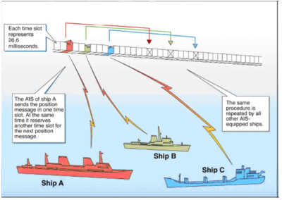

# 第二章：船载传感器基础

船联网技术作为物联网在海事领域的创新应用，本章专注于探讨船舶航行中现有的传感器基础，以及分析其在船联网体系框架下的地位。首先，我们将介绍船舶自动识别系统（AIS），它不仅在传统航海中起到至关重要的作用，也是船联网中数据收集和交换的关键环节。简要介绍电子海图显示与信息系统（ECDIS），并分析其在船联网中的角色。ECDIS通过集成丰富的航海数据，提高导航的精确度和效率。船舶导航雷达的介绍将关注于它如何配合船联网技术，提高航行中的避碰能力和航道监控效果。最后，本章将深入探讨船载感知设备系统架构，并分析这些传感器在船联网中如何协同工作，以提升船舶航行的效率和安全性。通过本章的学习，学生不仅能够深入了解这些关键传感器技术，还将理解它们在船联网中的集成应用，以及这种集成对提高现代海上通信、导航和航行安全的重要性。

## 2.1 船舶自动识别系统（AIS）

船舶自动识别系统（Automatic Identification System，简称AIS）是国际海事组织（IMO）、国际航标协会（IALA）、国际电信联盟（ITU-R）于2000年共同强力推广的一个具有船舶自动识别、通信和导航功能的新型助航电子系统。AIS 本质上是一个类似于应答器的船载广播系统。它在 VHF 海事频段运行，能够处理每分钟超过 4500 条报告，更新频率高达每两秒一次。这种高广播率和可靠的船对船操作是通过自组织时间分割多址访问（SOTDMA）技术实现的。该系统允许在雷达或电子图表上显示船舶符号，每个符号都指示速度和航向。这些符号可以反映出船舶的实际大小，精度达到 GPS 或差分 GPS。另外还可以显示船名、航向、速度、分类、呼号、注册号、MMSI、机动信息、最近会遇距离（CPA）、最近会遇时间（TCPA）等详细信息​​。AIS 的技术规格在国际电信联盟的 M.1371 推荐书中有所阐述。该文档于 2014 年 2 月获批准，详细介绍了在 VHF 海事移动频段使用时间分割多址访问的 AIS 技术特性。它为全球 AIS 系统的开发和实施提供了基础指导​​。

AIS 提供的信息，如唯一标识、位置、航向和速度，可以在电子海图显示和信息系统（ECDIS）上显示。它主要旨在协助船舶的值班官员，并使海事当局能够跟踪和监控船舶动态。AIS 将标准化的 VHF 收发器与定位系统（如 GPS）以及其他电子导航传感器（如陀螺罗盘或转向率指示器）集成在一起。国际海事组织要求国际航行船舶（300 总吨以上）和所有无论大小的客船都必须装备 AIS。然而，在某些情况下，船舶可以关闭其 AIS 应答器​​。在本地，AIS 使船舶能够在其区域内查看并被海上交通看到，使用专用的 VHF AIS 收发器。这些本地交通可以在航图绘制仪或计算机监视器上查看，信息传输范围通常限制在 10 至 20 海里。在全球范围内，从卫星和互联网连接的岸基站收集的 AIS 数据被聚合，并在网上提供。这提供了实时的全球覆盖位置数据，可通过任何具有互联网功能的设备访问。这些数据包括船名、位置、速度和航向，主要被船主、货物调度员和海事爱好者使用​​。

### 2.1.1 AIS工作原理

AIS的工作原理如图2-1-1所示，AIS在船舶间信息传输使用TDMA技术来实现，确保每个AIS设备在特定时间内传输信息，以避免数据传输冲突。每个AIS系统由一个VHF发射器、两个VHF TDMA接收器、一个VHF DSC接收器和标准的海洋电子通讯链接（IEC 61162/NMEA 0183）组成，连接到船上的显示和传感器系统。AIS系统通常从集成或外部全球导航卫星系统（例如GPS）接收器获得定位和时间信息，包括在沿海和内陆水域中用于精确定位的中频差分GNSS接收器​​。

<!--https://navcen.uscg.gov/how-ais-works-->
<figure style="text-align: center;">
  
  <figcaption>图 2-1-1 AIS工作原理 (来源：美国海岸警卫队导航中心)</figcaption>
</figure>

AIS通常以自主和连续模式工作，无论是在公海、沿海还是内陆水域。传输使用9.6 kb GMSK FM调制，通过25或12.5 kHz频道，使用HDLC数据包协议。尽管只需要一个无线电频道，但每个站点都在两个无线电频道上进行发送和接收，以避免干扰问题，并允许在不丢失与其他船只的通讯的情况下切换频道​​。每个站点根据数据链路流量历史和对其他站点未来行动的了解来确定自己的传输时间表（时隙）。一个AIS站点的位置报告适合于每60秒建立的2250个时间时隙之一。AIS站点不断地彼此同步，以避免时隙传输的重叠。AIS站点的时隙选择在一个定义的区间内随机化，并且用0到8帧之间的随机超时标记。当站点更改其时隙分配时，它会预先宣布新位置和该位置的超时​​。

根据国际海事组织（IMO）的性能标准，AIS设备所需的船只报告容量至少为每分钟2000个时隙，现在的系统一般可以提供每分钟4500个时隙。SOTDMA广播模式允许系统通过共享时隙超载400到500%，在船到船模式下仍然为相互距离8到10海里的船只提供近100%的吞吐量。在系统超载的情况下，只有较远的目标会受到丢失，以优先考虑对船舶操作员更为关注的近距离目标​​。AIS系统的覆盖范围与其他VHF应用类似，主要取决于天线的高度。由于波长较长，其传播略优于雷达，因此如果陆地不是太高，它可以在弯曲处和岛屿后面“看到”。在海上预期的典型值通常为20海里。借助中继站，可以大大改善船只和VTS站的覆盖范围​​。

VHF数据交换系统（VDES）是一种新型海事通信技术，被视为船舶自动识别系统（AIS）的继任者。VDES包括陆地和卫星通信组件，旨在为全球提供服务。这种系统的发展源于海上船只数量的增加，旨在通过提高容量和通过卫星提供的安全双向通信来升级现有的AIS。VDES不仅能够跟踪船只，还能在船只之间以及从船到岸之间传输信息，综合了现有的消息传递和船舶跟踪/防撞系统的功能​​​​​​。与AIS相比，VDES的主要优势在于它提供了更高的数据传输能力和更广泛的全球覆盖范围。此外，2015年的世界无线电大会已批准了VHF通信的数字化，并为VDES分配了一些现有的频率，这是对当前AIS服务的扩展​​。VDES目前正朝着成为国际电信联盟（ITU）标准的方向发展，得到了国际航标协会的广泛支持​​。

随着VDES技术的不断发展和标准化，预计将极大地提高海上通信的效率和安全性。VDES的全球覆盖能力和增强的数据交换功能预计将进一步促进海事行业的数字化转型，提高船舶与岸基结构之间的互动和协作能力。此外，随着更多船只和海上设施采用VDES，它可能成为未来海事通信和导航的关键技术，从而提升海上交通管理的整体性能和效率。

### 2.1.2 AIS设备类型

对于提高海上航行的安全性、效率以及环境保护至关重要。AIS主要分为Class A和Class B两种类型，每种类型具有不同的性能标准和应用场景。Class A AIS通常安装在符合国际海事组织（IMO）标准的大型船舶上，这些船舶包括货轮、客轮和其他大型商船。而Class B AIS则更多安装在较小的、不受IMO标准强制要求的船舶上，如休闲船、小型货船和渔船。了解这些AIS类型及其应用，有助于我们更好地理解船联网技术在现代航运业中的应用和重要性。接下来，我们将详细探讨每种AIS类型的特点及其在船联网中的具体作用。

- Class A AIS： 这类船载移动设备符合国际海事组织（IMO）的性能标准和运输要求。它们能够自主报告船只位置（大约每2-10秒一次，取决于船只的速度或航向变化；当锚泊或靠泊时，则每3分钟或更少一次）；同时，每6分钟报告一次船只的静态和航程相关信息。Class A AIS还能发送与安全相关的文本信息以及特定应用消息，如气象和水文数据、电子海员通告等​​。

- Class B AIS： 这类船载移动设备能与所有其他AIS站点互操作，但不满足IMO制定的所有性能标准。与Class A类似，它们锚泊或靠泊时每3分钟或更少一次报告位置，但其报告频率较低，功率也较小。它们每6分钟报告一次船只的静态数据，但不包括航程相关信息。Class B AIS可以接收与安全相关的文本和特定应用消息，但不能传输这些信息。Class B AIS分为两种类型，一种使用载波感知时分多址（CS-TDMA）技术，另一种则像Class A一样使用自组织时分多址（SO-TDMA）技术​​。

- AIS航标助航（AIS Aid to Navigation, ATON）： 这类岸基或移动站点提供航标的位置和状态，也可能广播特定应用消息。在美国，这些站点通常每三分钟或更少时间报告一次，且具有特定的海上移动服务身份号码（MMSI）标识​​。

- AIS搜索与救援发射器（SART）： 这类移动设备用于辅助定位（例如救生艇、救生筏）。AIS SART会发送文本广播，当激活时，还会每分钟发送一次位置消息​​。

站在船联网视角，AIS数据的运用是至关重要。通过Class A和B AIS提供的详细位置和航行信息，船联网组成的各类系统应用可以实时监控船只的动态，优化航道管理和交通控制。AIS航标助航和SART设备的数据则对于航道安全、航标状态监控和紧急救援行动至关重要。将这些数据集成到船联网系统中，可以大幅提升航运安全性，优化航运管理，进而实现高效的航运操作和应急响应。

### 2.1.3 AIS数据

国际电工委员会（IEC）为AIS设定了一系列的国际标准，以确保系统的兼容性、可靠性和安全性。这些标准包括AIS设备的设计、性能、测试方法和数据交换格式等方面。例如，IEC 61993-2是关于AIS系统船用设备的性能和测试方法的标准，它确保了不同制造商生产的AIS设备能够相互兼容和有效地工作。IEC的AIS标准对于保障海上通信的一致性、可靠性和有效性起着关键作用，有助于全球范围内的海上安全和航运管理。下表是AIS常见数据类型的简要介绍。

表 2-1-1 AIS常见数据类型（部分）

| 消息ID | 名称 | 描述 |
|-------|-----|------|
| 1 | 定位报告 | 定时位置报告；船载移动设备A类 |
| 2 | 定位报告 | 指定定时位置报告；船载移动设备A类 |
| 3 | 定位报告 | 特殊位置报告，回应询问；船载移动设备A类 |
| 4 | 基站报告 | 基站的位置、UTC、日期和当前时隙号 |
| 5 | 静态和航程相关数据 | 定时静态和航程相关船舶数据报告，船载移动设备A类 |
| 6 | 二进制定向消息 | 用于定向通信的二进制数据 |
| 7 | 二进制确认 | 收到的定向二进制数据的确认 |
| 8 | 二进制广播消息 | 用于广播通信的二进制数据 |
| 9 | 标准SAR航空器位置报告 | 仅用于SAR操作的空中站点的位置报告 |
| 10 | UTC/日期查询 | 请求UTC和日期 |
| 11 | UTC/日期响应 | 当前可用的UTC和日期 |
| 12 | 定向安全相关消息 | 用于定向通信的安全相关数据 |
| 13 | 安全相关确认 | 收到的定向安全相关消息的确认 |
| 14 | 安全相关广播消息 | 用于广播通信的安全相关数据 |
| 15 | 询问 | 请求特定消息类型，可能导致一个或多个站点的多个响应 |

AIS数据的应用范围非常广泛，包括船舶交通监控、海上搜救、环境保护和航海安全管理等。例如，AIS数据可用于船舶交通监控，以提高航运安全性和效率。AIS数据还可用于海上搜救，以及船舶和船员的紧急救援。此外，AIS数据还可用于环境保护，例如监测海洋污染和海洋生物保护区域。AIS数据还可用于航海安全管理，例如航道安全、航标状态监控和紧急救援行动等。将这些数据集成到船联网系统中，可以大幅提升航运安全性，优化航运管理，进而实现高效的航运操作和应急响应。

### 2.1.4 AIS数据报文

AIS数据报文是AIS数据的基本单位，它们包含了船舶的位置、航向、航速、船名、船舶类型、船舶尺寸、船舶状态、船舶目的地、船舶MMSI号码、船舶呼号、船舶IMO号码等信息。下面我们以Class A AIS数据报文格式举例，下表是AIS数据报文的格式。

表 2-1-2 AIS数据报文格式

| 字段               | 名称         | 描述                                          |
|------------------|------------|---------------------------------------------|
| Message ID       | 消息ID       | 标识消息类型（1，2，3）                                |
| Repeat Indicator | 重复指示器     | 显示消息被重复发送的次数                                  |
| MMSI             | 船舶识别码     | 全球唯一的船舶标识                                    |
| Navigation Status| 航行状态      | 描述船舶的当前运行状态，如航行、停泊等                      |
| Rate of Turn     | 转向率       | 船舶转弯的速度和方向，向左或向右                           |
| Speed Over Ground| 对地航速     | 船舶相对于地面的移动速度，以节为单位                        |
| Position Accuracy| 位置精度     | 位置报告的准确性，高精度或低精度                            |
| Longitude        | 经度        | 船舶的经度位置                                      |
| Latitude         | 纬度        | 船舶的纬度位置                                      |
| Course Over Ground| 对地航向    | 船舶相对于地面的运动方向                                |
| True Heading     | 真航向      | 船舶的实际朝向                                      |
| Time Stamp       | 时间戳      | 报告生成的具体时间，以UTC秒计                           |
| Maneuver Indicator| 操纵指示器   | 显示船舶是否在进行特殊操纵                              |
| Spare            | 备用        | 留作未来使用的备用字段                                  |
| RAIM Flag        | RAIM标志    | 指示接收机自主完整性监测（RAIM）功能的状态                |
| Communication State | 通信状态 | 描述船舶通信设备的状态和通信能力                          |

AIS Class A位置报告用于详细描述船舶的当前状况。消息ID（6位bits）用于标识消息的类型。重复指示器（2位）表明消息被重复发送的次数，用于帮助接收者判断信息的新旧。用户ID（30位）即船舶的MMSI编号，是船舶在全球范围内的唯一标识。导航状态（4位）显示船舶的当前运行状况，如正在使用引擎航行、停泊、搁浅等。转向率（8位）指船舶转弯的速度，表明船舶是向左还是向右转，以及转弯的快慢。对地速度（10位）船舶相对于地面的移动速度，以节为单位。位置精度（1位）表明位置报告的准确性，高精度或低精度。经度和纬度（分别为28位和27位）确定船舶的地理位置。对地航向（12位）船舶相对于地面的运动方向。真航向（9位）船舶实际的朝向。时间戳（6位）报告生成的具体时间，以UTC秒计。特殊操纵指示器（2位）显示船舶是否正在进行特殊操纵，如避让等。通过这些参数，可以对船舶的位置、速度、航向等关键信息进行详细了解，这对于海上交通安全和航行管理至关重要，更多参数信息可以参考官方文档。

### 2.1.5 AIS设备性能标准

AIS设备的性能标准由国际海事组织（IMO）制定，以确保AIS设备的兼容性、可靠性和安全性。这些标准包括AIS设备的设计、性能、测试方法和数据交换格式等方面。例如，IMO的AIS性能标准包括AIS设备的技术特性、功能要求、测试方法和接口要求等。IMO的AIS性能标准对于保障海上通信的一致性、可靠性和有效性起着关键作用，有助于全球范围内的海上安全和航运管理。

## 2.2 电子海图显示与信息系统（ECDIS）

## 2.3 船舶导航雷达

## 2.4 船载感知设备系统架构
